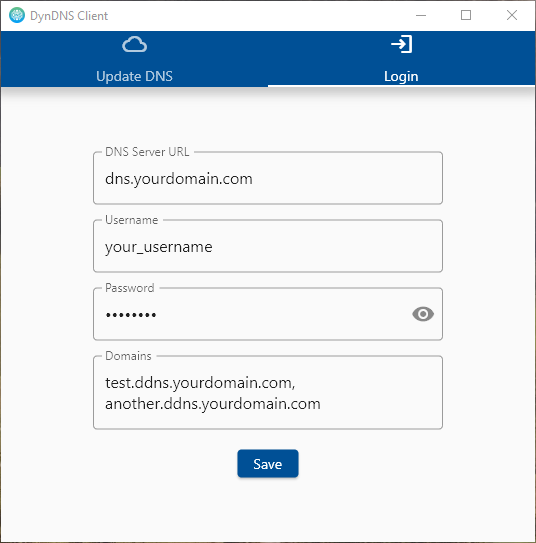
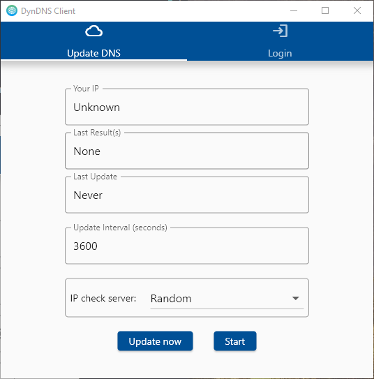

# dyndns_client

A DynDNS Desktop client written in Dart using Flutter.

## Usage

* Enter your DNS Server URL, Username, Password and Domains to register under the 'Login' tab,
  separate domains by comma, new lines or both: 
  

* Enter an update interval and select a Server to fetch your IP Address from (or select 'Random'
  to choose a random server each time), then, press 'Update now' to update the Addresses now
  or select 'Start' to update the Addresses in intervals: 
  

## Copyright

Licensed under the MIT License

<a href="https://www.flaticon.com/free-icons/dns" title="dns icons">Application icon created by SumberRejeki -
Flaticon</a>